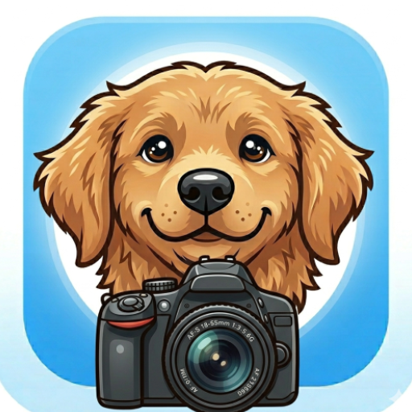

# DogCam 🐾

**DogCam** is a professional-grade camera application designed specifically for pet photography. It uses advanced ML Kit object detection to ensure that a photo is only captured when a dog (or cat!) is perfectly in frame.

## 🌟 Key Features

- **Smart Pet Detection:** The shutter is intelligently locked unless a dog or cat is detected. No more "empty" shots!
- **Professional Bounding Boxes:** Real-time ML tracking with "Target" species identification (Green for pets, White for others).
- **Branded Watermarking:** Every photo is automatically saved with a high-visibility "DogCam" text and icon watermark.
- **Secret Cat Mode:** Tap the species toggle to switch between Dog and Cat detection modes.
- **Custom Shutter Sounds:** Features satisfying dog barks and secret meow sounds for the cat mode.
- **Advanced Camera Controls:**
  - Smooth zoom slider with haptic feedback at 1.0x.
  - Tap-to-Focus with visual feedback and 3-second AF/AE lock.
  - Full support for both front and rear cameras.
- **Intelligent UI:** All interface elements (buttons, labels, bounding boxes) rotate seamlessly with the phone's orientation.
- **Pro Storage:** Photos are saved to a dedicated `Pictures/DogCam` folder in your gallery.

## 📸 Screenshots

  

| Smart Tracking UI | About & Features |
| :---: | :---: |
| *[Tracking Screenshot Coming Soon]* | *[About Dialog Screenshot Coming Soon]* |

## 🚀 Versioning
Current Version: **1.001**
*The version is manually incremented by 0.001 for every significant update.*

## 📄 License
This project is for personal use and demonstration of ML Kit and CameraX integration.

---
Developed with ❤️ for dogs and cats everywhere. 🐾(P)AWESOME!
